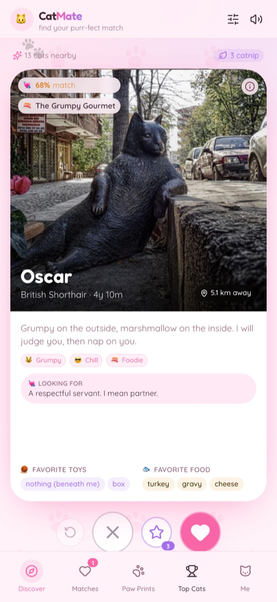
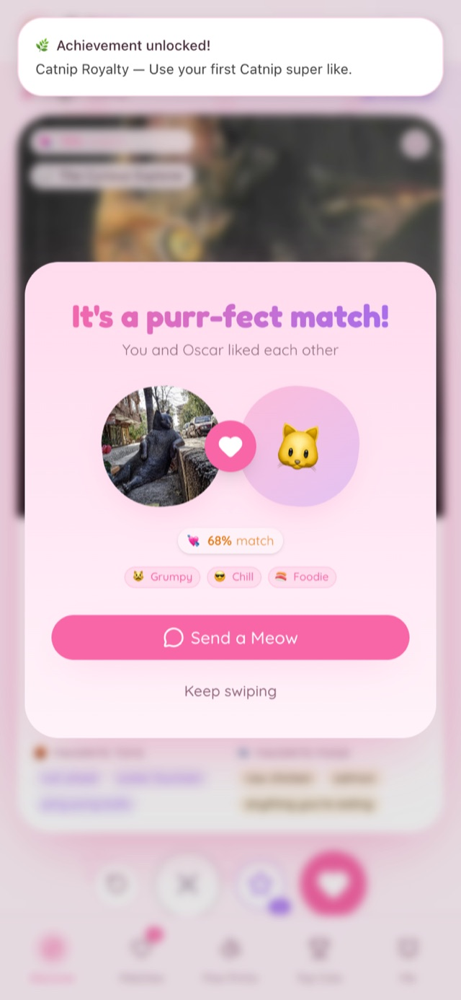
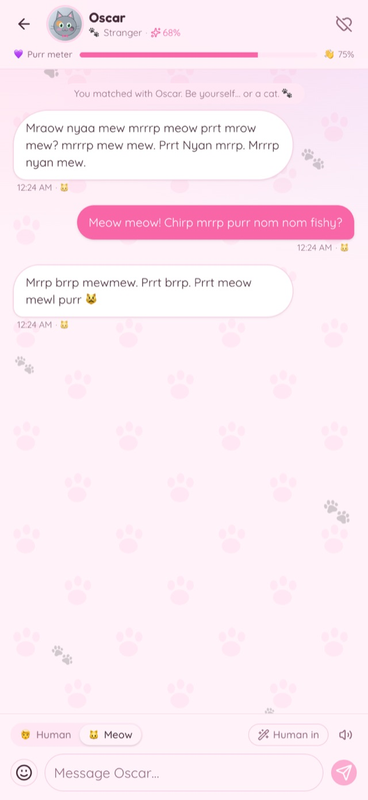
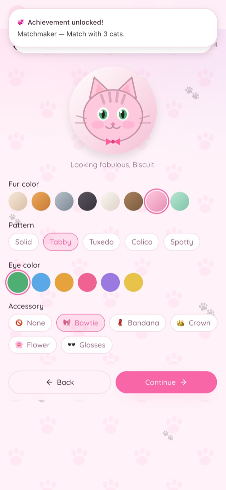
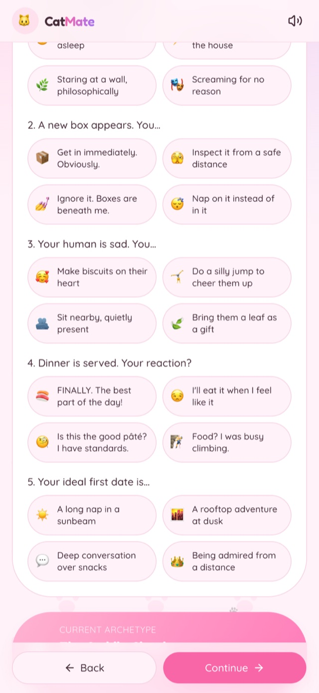
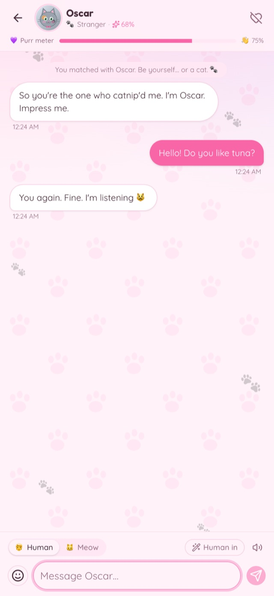
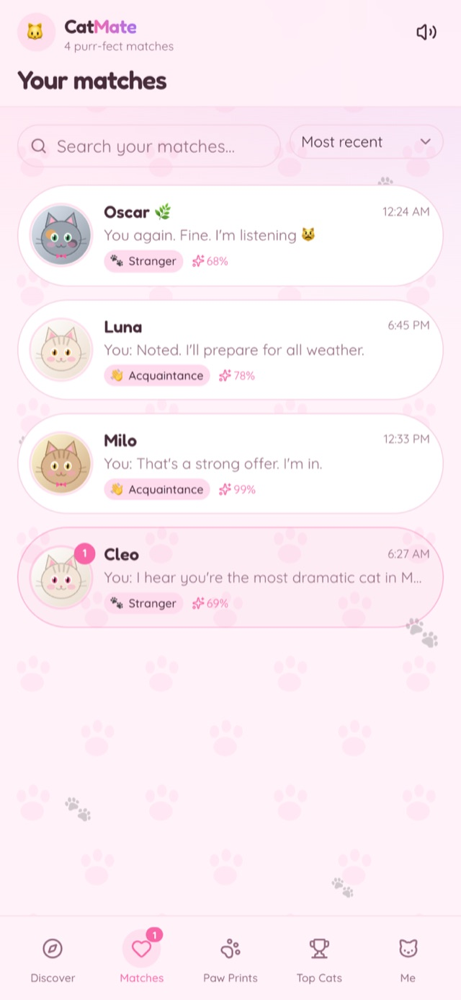
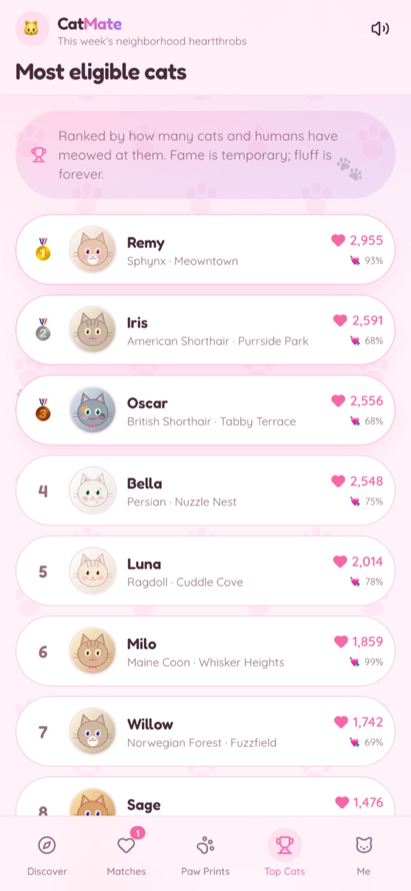
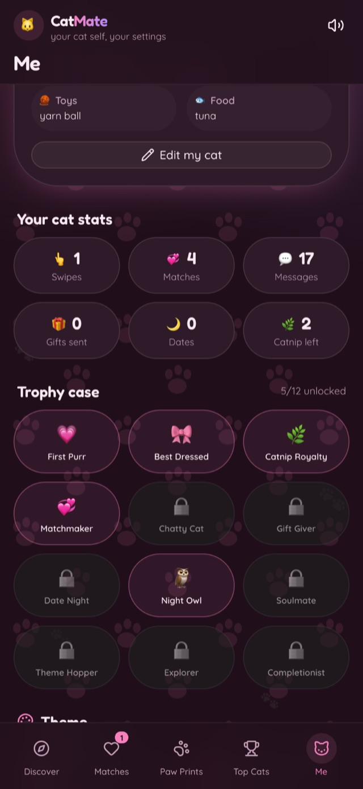

<div align="center">

# 🐱 CatMate

**Find your purr-fect match.**

A delightfully fluffy cat-dating app — swipe adorable cats, match on shared
purr-sonality, and chat in **Human** or **Meow**.

[](https://cat-mate-gamma.vercel.app)
[](https://nextjs.org)
[](https://react.dev)
[](https://www.typescriptlang.org)
[](https://tailwindcss.com)

[**Open the live app →**](https://cat-mate-gamma.vercel.app)

</div>

---

## 📸 Screenshots

| Discover | It's a purr-fect match | Chat · Meow mode |
| :---: | :---: | :---: |
|  |  |  |

| Onboarding · Avatar | Onboarding · Purr-sonality | Chat · Human mode |
| :---: | :---: | :---: |
|  |  |  |

| Matches | Most eligible cats | Midnight Nap theme |
| :---: | :---: | :---: |
|  |  |  |

---

## ✨ Features

### 🎀 Create your cat
- Four-step onboarding wizard: **basics → look → purr-sonality → favorites**.
- **SVG cat-avatar builder** — fur color, coat pattern, eye color, and an
  accessory (bowtie, bandana, crown, flower, glasses).
- **Paw-sonality quiz** — five playful questions that reveal one of **eight cat
  archetypes** (The Cuddle Cloud, The Grumpy Gourmet, The Zoomie Gremlin…).
- Pick favorite toys, favorite foods, and a bio.

### 💘 Discover
- **Tinder-style swipe deck** with drag physics, rotation, and
  **MEOW / HISS / CATNIP** stamps (mouse, touch, or arrow keys).
- **Compatibility scoring** (40–99%) from shared traits, toys, foods, age, and
  distance — shown on every card, match, and profile.
- **Catnip super-likes** with a daily token allowance.
- **Paw-undo** to rewind your last swipe.
- **Whiskers filters** by personality, distance, and breed.
- **Cat of the day**, cat facts between swipes, and generated purr/hiss/meow
  sound effects (Web Audio, mutable).

### 💬 Chat — Human ↔ Meow
- **Human / Meow display toggle** — flip the whole conversation between plain
  English and cat speak.
- **Meow-mode composer** — type in Meow and it translates *to Human* before
  sending (and vice-versa), with a live translation preview.
- **Icebreakers**, cat **stickers**, and virtual **gifts** (tuna, catnip, yarn…).
- **Cat Café dates** — book a mini date (sunbeam nap, laser chase, stargazing)
  and get a story plus a reaction.
- **Purr meter & relationship stages** — Stranger → Acquaintance → Friend →
  Bestie → **Soulmate**.
- Typing indicator, read receipts (🐾🐾), personality-driven replies, and
  **Meow TTS** (pitch-shifted Web Speech).

### 🐾 More
- **Matches** grid with search, sorting, stage chips, and unread badges.
- **Paw Prints** — full swipe history with “bring back”.
- **Most Eligible Cats** leaderboard.
- **Achievements** trophy case (12 badges) with unlock toasts.
- **Four themes** — Bubblegum, Strawberry Milk, Peach Fuzz, and **Midnight Nap**
  (dark).
- Everything persists in `localStorage`, so matches and chats survive a reload.

---

## 🧰 Tech stack

| Area | Choice |
| --- | --- |
| Framework | **Next.js 16** (App Router, Route Handlers) |
| UI | **React 19**, **Tailwind CSS v4**, **shadcn/ui** |
| Language | **TypeScript** (strict) |
| State | **Zustand** + `persist` middleware |
| Animation | **motion** (Framer Motion) |
| Icons | **lucide-react** |
| Sound | **Web Audio API** (synthesized — no audio files) |
| Voice | **Web Speech API** (Meow TTS) |
| Backend | Next.js **Route Handlers** as a mock API (in-memory, seeded) |

---

## 🚀 Getting started

### Prerequisites
- **Node.js 20+**
- npm (or pnpm / yarn / bun)

### Install & run

```bash
# 1. Clone
git clone https://github.com/spr021/Cat-Mate.git
cd Cat-Mate

# 2. Install dependencies
npm install

# 3. Start the dev server
npm run dev
```

Open **http://localhost:3000** 🎉

> No environment variables or database are required — the API is mocked in
> memory and the app persists to `localStorage`.

### Production build

```bash
npm run build
npm start
```

---

## 🔌 Mock API

All endpoints live under `app/api/*` and return seeded data with a small
simulated latency.

| Method | Endpoint | Description |
| --- | --- | --- |
| `GET` | `/api/cats` | All discoverable cat profiles |
| `POST` | `/api/swipe` | `{ catId, action: "like" \| "pass" \| "catnip" }` → `{ matched, match? }` |
| `POST` | `/api/chat/reply` | `{ catId, text, messageCount }` → personality-based cat reply |
| `POST` | `/api/meow/translate` | `{ text, direction: "toMeow" \| "fromMeow" }` → translation |
| `GET` | `/api/matches` | Seeded starter matches with conversations |
| `GET` | `/api/facts` | Cat facts |
| `GET` | `/api/leaderboard` | Mock “most eligible cats” ranking |
| `POST` | `/api/date` | `{ catId, activityId }` → a Cat Café date |
| `POST` | `/api/gift` | `{ catId, giftId }` → gift reaction + affection |

---

## 🐾 The Meow translator

`lib/meow.ts` is a deterministic, offline translator:

- **`toMeow(text)`** — maps common words via a dictionary (`hello → meow meow`,
  `love → prrrr`, `food → nom nom`, `no → hiss`) and generates consistent
  hash-based meow syllables for everything else.
- **`fromMeow(text)`** — reverses it using the dictionary plus a session map.
- Every message stores **both** its human text and its meow, so the chat toggle
  is always exact — the translator powers live previews and cat replies.

---

## 🎨 Themes

Themes are CSS-variable token sets in `app/globals.css`, switched via a
`data-theme` attribute on `<html>`:

`bubblegum` (default) · `strawberry` · `peach` · `midnight` (dark, also toggles
the `.dark` class).

---

## 📁 Project structure

```
cat-mate/
├─ app/
│  ├─ page.tsx                 # Discover — swipe deck
│  ├─ onboarding/              # Create-your-cat wizard
│  ├─ matches/                 # Matches list
│  ├─ chat/[matchId]/          # Chat (Human ↔ Meow)
│  ├─ paw-prints/              # Swipe history
│  ├─ leaderboard/             # Most eligible cats
│  ├─ me/                      # Profile, themes, achievements
│  ├─ api/                     # Mock API route handlers
│  ├─ layout.tsx               # Fonts, providers, metadata
│  └─ globals.css              # Theme tokens + utilities
├─ components/
│  ├─ catmate/                 # App components (deck, card, chat, …)
│  └─ ui/                      # shadcn/ui primitives
├─ lib/
│  ├─ meow.ts                  # Human ↔ Meow translator
│  ├─ compat.ts                # Compatibility + relationship stages
│  ├─ archetypes.ts            # Cat archetypes
│  ├─ store.ts                 # Zustand store (persisted)
│  ├─ sound.ts                 # Web Audio purr/hiss/meow
│  ├─ tts.ts                   # Meow text-to-speech
│  ├─ mock/                    # Seed cats, replies, facts
│  └─ server/mock.ts           # Server-side mock helpers
├─ docs/screenshots/           # README screenshots
└─ public/                     # Static assets
```

---

## 📜 Scripts

| Command | Description |
| --- | --- |
| `npm run dev` | Start the dev server |
| `npm run build` | Production build |
| `npm start` | Run the production build |
| `npm run lint` | ESLint |

---

## ☁️ Deployment

Deployed on **Vercel**: **[cat-mate-gamma.vercel.app](https://cat-mate-gamma.vercel.app)**

To deploy your own:

```bash
npm i -g vercel
vercel            # preview
vercel --prod     # production
```

Or import the repository at [vercel.com/new](https://vercel.com/new) — no
configuration needed (Next.js is auto-detected).

---

<div align="center">

Made with 💗 and a lot of fluff.

🐾 *No cats were inconvenienced in the making of this app.*

</div>
